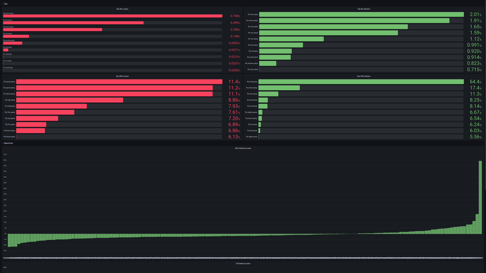

# Prop
[](https://github.com/fremantle-industries/prop/actions?query=workflow%3Atest)
[](https://hex.pm/packages/prop)

DeFi? CeFi? TradFi?

`prop` is an open and opinionated trading platform using productive & familiar
open source libraries and tools for strategy research, execution and operation.

## Install

Add `prop` to your list of dependencies in `mix.exs`

```elixir
def deps do
  [
    {:prop, "~> 0.0.4"}
  ]
end
```

## Usage

```bash
$ docker-compose up
```

Visit [`prop.localhost`](http://prop.localhost)

When running the application with `docker-compose` you will need to enter the basic auth development credentials:

```
username: admin
password: password
```

## Requirements

`prop` requires Elixir 1.12+, Erlang/OTP 22+ & Rust.

We recommend using [`asdf`](https://github.com/asdf-vm/asdf) to manage the language requirements.

- [https://github.com/asdf-vm/asdf-erlang](https://github.com/asdf-vm/asdf-erlang)
- [https://github.com/asdf-vm/asdf-elixir](https://github.com/asdf-vm/asdf-elixir)
- [https://github.com/asdf-community/asdf-rust](https://github.com/asdf-community/asdf-rust)

## Prop - [http://prop.localhost](http://prop.localhost)




## Workbench - [http://workbench.localhost](http://workbench.localhost)

From idea to execution, manage your trading operation across a distributed cluster

[](https://github.com/fremantle-industries/workbench)

## History - [http://history.localhost](http://history.localhost)

Download and warehouse historical trading data

[](https://github.com/fremantle-industries/history)

## Rube - [http://rube.localhost](http://rube.localhost)

A multi-chain DeFi development toolkit

[](https://youtu.be/f2phGFZrh80)

## Slurpee - [http://slurpee.locahost](http://slurpee.localhost)

A GUI frontend to manage blockchain ingestion with slurp

[](https://github.com/fremantle-industries/slurpee)

## Explore Data with LiveBook - [http://livebook.localhost](http://livebook.localhost)


## Grafana - [http://grafana.localhost](http://grafana.localhost)


## Prometheus - [http://prometheus.localhost](http://prometheus.localhost)


## Tools

* [workbench](https://github.com/fremantle-industries/workbench) - Manage your trading operation across a distributed cluster
* [history](https://github.com/fremantle-industries/history) - Download and warehouse historical trading data
* [tai](https://github.com/fremantle-capital/tai) - Composable, real time, market data and trade execution toolkit
* [rube](https://github.com/fremantle-industries/rube) - A multi-chain DeFi development toolkit for Elixir
* [slurpee](https://github.com/fremantle-industries/slurpee) - A GUI frontend to manage blockchain ingestion with slurp
* [slurp](https://github.com/fremantle-industries/slurp) - Blockchain ingestion toolkit
* [livebook](https://github.com/elixir-nx/livebook) - Livebook is a web application for writing interactive and collaborative code notebooks built with Phoenix LiveView
* [grafana](https://grafana.com) - Dashboard Monitoring. Store & Visualize Your Metrics
* [timescaledb](https://www.timescale.com) - Relational database for time-series data. Supercharged PostgreSQL
* [prometheus](https://prometheus.io) - An open-source monitoring system with a dimensional data model, flexible query language, efficient time series database and modern alerting

## Development

Initial setup:

- Installs `hex` and `npm` dependencies
- Generates migrations for history, workbench and tai
- Runs migrations
- Seeds database

```bash
$ docker-compose up db
$ mix setup
$ mix phx.server
```

## Test

```bash
$ docker-compose up db
$ mix test
```

## Ecto Database

Reset drops the db, creates a new db & runs the migrations

```bash
$ mix ecto.reset
```

Migrate up

```bash
$ mix ecto.migrate
```

Migrate down

```bash
# Last migration
$ mix ecto.rollback
# Last 3 migrations
$ mix ecto.rollback -n 3
```

## Authors

- Alex Kwiatkowski - alex+git@fremantle.io

## License

`prop` is released under the [MIT license](./LICENSE.md)
